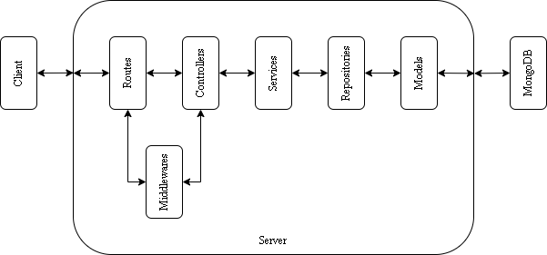

## Table of Contents

- [Table of Contents](#table-of-contents)
- [How to Run](#how-to-run)
- [Database Schema](#database-schema)
  - [1. Video Collection Schema](#1-video-collection-schema)
  - [2. Comment Collection Schema](#2-comment-collection-schema)
  - [3. Product Collection Schema](#3-product-collection-schema)
  - [4. User Collection Schema](#4-user-collection-schema)
- [API Structure](#api-structure)
- [API Endpoints](#api-endpoints)
- [Data Migration](#data-migration)
- [Deployment](#deployment)

## How to Run

1. Clone this repository.
2. Navigate to the project directory using the terminal.
3. Install the required dependencies by running:

   ```
   npm install
   ```

4. Create .env file:

   ```
   cp .env.example .env
   ```

5. Run the app:

   ```
   npm run dev
   ```

6. App running at:

   ```
   http://localhost:5000
   ```

## Database Schema

### 1. Video Collection Schema

**Schema Definition:**

```javascript
const videoSchema = new mongoose.Schema({
  youtubeVideoId: {
    type: String,
    required: true,
  },
  comments: [commentSchema],
  products: [
    {
      type: mongoose.Schema.Types.ObjectId,
      ref: "Product",
    },
  ],
  createdAt: {
    type: Number,
    default: Date.now(),
  },
  viewCount: {
    type: Number,
    default: 0,
  },
});
```

**Fields:**

- `youtubeVideoId` (String, required): The ID of the youtube video.
- `comments` (Array of commentSchema): An array of comments.
- `products` (Array of ObjectIds, ref: 'Product'): An array of product IDs. References to Product collection.
- `createdAt` (Number, default: Date.now()): The time when the video created.
- `viewCount` (Number, default: 0): Total number of video views.

### 2. Comment Collection Schema

**Schema Definition:**

```javascript
const commentSchema = new mongoose.Schema(
  {
    user: {
      type: mongoose.Schema.Types.ObjectId,
      ref: "User",
    },
    comment: {
      type: String,
      required: true,
    },
    createdAt: {
      type: Number,
      default: Date.now(),
    },
  },
  { _id: false }
);
```

**Fields:**

- `user` (ObjectId, ref: 'User'): the user ID that makes a comment. References to User Collection.
- `comment` (String, required): Comment text.
- `createdAt` (Number, default: Date.now()): The time when the comment created.

### 3. Product Collection Schema

**Schema Definition:**

```javascript
const productSchema = new mongoose.Schema({
  title: {
    type: String,
    required: true,
  },
  price: {
    type: Number,
    required: true,
  },
  url: {
    type: String,
    required: true,
  },
  imageUrl: {
    type: String,
    required: true,
  },
});
```

**Fields:**

- `title` (String, required): The title of the product.
- `price` (Number, required): The price of the product.
- `url` (String, required): The URL of the product.
- `imageUrl` (String, required): The image URL of the product.

### 4. User Collection Schema

**Schema Definition:**

```javascript
const userSchema = new mongoose.Schema({
  username: {
    type: String,
    required: true,
    unique: true,
  },
  password: {
    type: String,
    required: true,
  },
  profileColor: {
    type: String,
    required: true,
  },
});
```

**Fields:**

- `username` (String, required, unique): The username of the user.
- `password` (String, required): The password of the user.
- `profileColor` (String, required): The color of user profile.

## API Structure



Clients requests are received by Routes which will then be forwarded to Controllers with some requests going through Middlewares. Middleware is useful for processing requests before they are processed by Controllers. Controllers will process the request and will call Services according to the client's request. Then Services will create a response from the client request with the appropriate data obtained from Repositories. Repositories are useful for obtaining, creating, and changing data from MongoDB using Models.

## API Endpoints

1. `GET /video`: Get all videos.
2. `GET /video/:videoId`: Get detail of a specific video.
3. `GET /video/:videoId/comment`: Get all comments from a specific video.
4. `GET /video/:videoId/product`: Get all products from a specific video.
5. `POST /video/:videoId/comment`: Create a new comment for a specific video.
6. `POST /register`: Create a new account.
7. `POST /login`: Login to an existing account.

Detailed explanation: [API Endpoints](https://gist.github.com/fruzdh/ee174b458d419b86deed7cbccb10654f).

## Data Migration

1. Navigate to the project directory using the terminal.
2. Install the required dependencies by running:

   ```
   npm install
   ```

3. Create .env file:

   ```
   cp .env.example .env
   ```

4. Run Data Migration:

   ```
   npm run migrate
   ```

## Deployment

[https://gigih-final-project-fruzdh.vercel.app](https://gigih-final-project-fruzdh.vercel.app)
